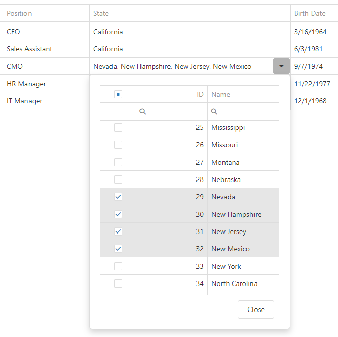

<!-- default badges list -->

[](https://supportcenter.devexpress.com/ticket/details/T548916)
[](https://docs.devexpress.com/GeneralInformation/403183)
<!-- default badges end -->

# DataGrid - How to use DropDownBox as a column editor in edit mode

This example illustrates how to define a [DropDownBox](https://js.devexpress.com/Documentation/ApiReference/UI_Widgets/dxDropDownBox/) with an embedded [DataGrid](https://js.devexpress.com/Documentation/ApiReference/UI_Widgets/dxDataGrid/) for the State column.



## Implementation Details

1. Handle the [onEditorPreparing](https://js.devexpress.com/Documentation/ApiReference/UI_Widgets/dxDataGrid/Configuration/#onEditorPreparing) event. In the event handler, change the editorName and [editorOptions](https://js.devexpress.com/Documentation/ApiReference/UI_Components/dxDataGrid/Configuration/columns/#editorOptions) parameters to specify the [DropDownBox](https://js.devexpress.com/Documentation/ApiReference/UI_Widgets/dxDropDownBox/) settings.

   ```javascript
   function onEditorPreparing(e) {
       if (e.dataField == "StateID" && e.parentType == "dataRow") {
           e.editorName = "dxDropDownBox";                
           e.editorOptions.dropDownOptions = {                
               height: 500
           };
           e.editorOptions.contentTemplate = function (args, container) { 
               //custom template;
           }
       }
   }
   ```
2. Implement the [contentTemplate](https://js.devexpress.com/Documentation/ApiReference/UI_Components/dxPopup/Configuration/#contentTemplate) function. In this template: 
   - Define DataGrid and handle its [selectionChanged](https://js.devexpress.com/Documentation/ApiReference/UI_Widgets/dxDataGrid/Configuration/#onSelectionChanged) event to pass the selected keys to dxDropDownBox. 
   - Handle the [DropDownBox.valueChanged](https://js.devexpress.com/Documentation/ApiReference/UI_Widgets/dxDropDownBox/Configuration/#onValueChanged) event to adjust DataGrid selection.

   ```javascript
   e.editorOptions.contentTemplate = function (args, container) {
       var value = args.component.option("value"),
       $dataGrid = $("<div>").dxDataGrid({                           
          dataSource: args.component.option("dataSource"),
          keyExpr: "ID",
          //code
          selection: { mode: "multiple" },
          selectedRowKeys: value,
          onSelectionChanged: function (selectedItems) {
             var keys = selectedItems.selectedRowKeys;
             args.component.option("value", keys);
          }
       });
       var dataGrid = $dataGrid.dxDataGrid("instance");
       args.component.on("valueChanged", function (args) {
          var value = args.value;
          dataGrid.selectRows(value, false);
       });
       container.append($dataGrid);
       $("<div>").dxButton({
          text: "Close",
           onClick: function (ev) {
              args.component.close();
          }
       }).css({ float: "right", marginTop: "10px" }).appendTo(container);
       return container;
   };
   ```

## Files to Look At

- [index.html](/jQuery/index.html)
- [script.js](/jQuery/script.js)

## Documentation

- [Getting Started with DataGrid](https://js.devexpress.com/Documentation/Guide/UI_Components/DataGrid/Getting_Started_with_DataGrid/)
- [DropDownBox Overview](https://js.devexpress.com/Documentation/Guide/UI_Components/DropDownBox/Overview/)
- [Synchronize with the Embedded Element](https://js.devexpress.com/Documentation/Guide/UI_Components/DropDownBox/Synchronize_with_the_Embedded_Element/)

## More Examples

- [MVC DataGrid - How to use DropDownBox as a column editor in edit mode](https://www.devexpress.com/Support/Center/p/T576412)
